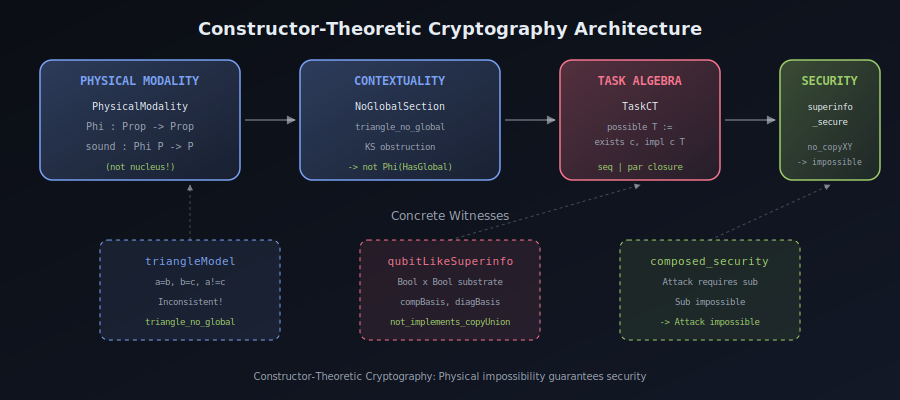
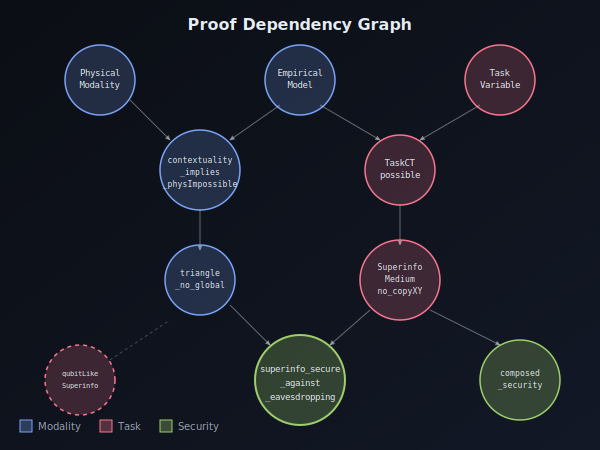
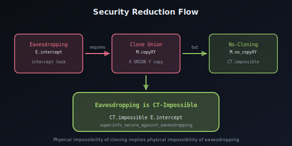
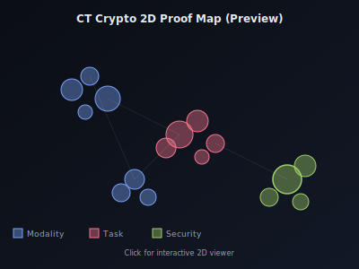

# Constructor-Theoretic Cryptography

<p align="center">
  <strong>Machine-checked formalization of Constructor Theory cryptographic security</strong><br/>
  <em>
    Lean 4 proofs that no-cloning implies eavesdropping impossibility via KS-style contextuality
  </em>
</p>

<p align="center">
  
  
  
  
</p>

---

Part of the broader HeytingLean formal verification project: https://apoth3osis.io

## Abstract

**Why this matters:** Traditional cryptographic security relies on computational hardness assumptions—problems believed to be difficult for classical or quantum computers. This approach is fundamentally fragile: a single algorithmic breakthrough could invalidate entire cryptographic ecosystems overnight.

**A new foundation:** This repository presents a radically different approach grounded in **Constructor Theory**, the Deutsch-Marletto framework that reformulates physics in terms of which transformations are *possible* and which are *impossible*. Instead of computational complexity, we derive security from **physical law itself**.

**The key insight:** In quantum mechanics, certain information (superinformation) cannot be cloned—not because cloning is computationally hard, but because *no physical process can accomplish it*. We formalize this as:

> If eavesdropping requires cloning a superinformation medium, and cloning is physically impossible, then eavesdropping is physically impossible.

This is not a computational assumption. It is a theorem about the structure of physical reality.

**What we formalize:**
- A **physical possibility modality** with the correct Constructor-Theoretic polarity (`Φ P → P`, not inflationary)
- A bridge from **Kochen-Specker contextuality** (no-hidden-variables) to physical impossibility
- **Task algebra** with constructor existence semantics
- **Superinformation media** where individual observables are clonable but their union is not
- A **main security theorem** proving no-cloning implies eavesdropping impossibility
- **Compositional security transfer** (completely axiom-free!)

**What you can do with this:**
- Use the formalized structures as a foundation for **verified quantum cryptography**
- Instantiate the abstract interfaces with concrete quantum-mechanical models
- Build **composable security proofs** for protocols like BB84, quantum commitments, etc.
- Explore the connection between **contextuality** and **cryptographic hardness**

**NEW: Photoemission Physics Extension:**
- **Typed quantum channels** (CPTP maps between Hilbert substrates)
- **Three-step photoemission model** (Malhotra): Absorption → Transport → Emission
- **TaskCT instance** for photoemission enabling CT composition lemmas
- **Energy conservation constraint**: `photonEnergy < bandGap → absorption impossible`
- **Coherence enhancement** and Fermi Golden Rule interface layers

**Future research directions:**
- Formalization of BB84 and other QKD protocols within this framework
- Extension to **thermodynamic** impossibility (second law)
- Connection to **complexity-theoretic** security for hybrid guarantees
- Categorical semantics and the topos-theoretic perspective

---

## Results (One Story)

This repository mechanizes the **Constructor-Theoretic approach to cryptographic security**:

1. **Physical Modality**: A sound possibility operator `Phi P -> P` capturing "physically realizable"
2. **Contextuality Bridge**: Kochen-Specker obstruction `NoGlobalSection -> not Phi(HasGlobalSection)`
3. **Task Algebra**: Constructor existence model with serial/parallel composition
4. **Superinformation Media**: Information variables where union cannot be cloned
5. **Security Theorem**: No-cloning implies eavesdropping CT-impossible

The central insight: **physical impossibility (not just logical negation) of cloning** provides cryptographic security guarantees.

---

## Security Architecture Visualized

<p align="center">
  
</p>

<p align="center"><em>Layered architecture: Contextuality -> Physical Impossibility -> Security</em></p>

<table>
<tr>
<td align="center" width="50%">

<br/><strong>Proof Dependency Graph</strong><br/>
<em>Key theorems and their relationships</em>
</td>
<td align="center" width="50%">

<br/><strong>Security Reduction Flow</strong><br/>
<em>No-cloning to eavesdropping impossibility</em>
</td>
</tr>
</table>

---

## Proof Visualizations

Explore the proof structure in 2D and 3D:

<table>
<tr>
<td align="center" width="50%">
<strong>2D Proof Map</strong><br/>
<em>Pan, zoom, search declarations</em><br/>
<a href="https://abraxas1010.github.io/ct-crypto-lean/RESEARCHER_BUNDLE/artifacts/visuals/ct_crypto_2d.html">
  
</a><br/>
<a href="https://abraxas1010.github.io/ct-crypto-lean/RESEARCHER_BUNDLE/artifacts/visuals/ct_crypto_2d.html">Interactive 2D Viewer</a>
</td>
<td align="center" width="50%">
<strong>3D Proof Map</strong><br/>
<em>Rotate, zoom, explore clusters</em><br/>
<a href="https://abraxas1010.github.io/ct-crypto-lean/RESEARCHER_BUNDLE/artifacts/visuals/ct_crypto_3d.html">
  
</a><br/>
<a href="https://abraxas1010.github.io/ct-crypto-lean/RESEARCHER_BUNDLE/artifacts/visuals/ct_crypto_3d.html">Interactive 3D Viewer</a>
</td>
</tr>
</table>

Declarations visualized with UMAP embeddings:
- Color-coded by module (PhysicalModality, TaskCT, Security, etc.)
- Click nodes to see theorem details and code
- kNN edges show proof similarity neighborhoods

---

## What's Formalized

| Component | Description |
|-----------|-------------|
| **PhysicalModality** | Sound modality on `Prop`: `Phi P -> P` (not nucleus!) |
| **ContextualityPhysical** | KS-style bridge: `NoGlobalSection -> not Phi(HasGlobalSection)` |
| **TaskCT** | Constructor existence interface: `possible T := exists c, implements c T` |
| **InfoVariable** | CT information variable with permutation and copy tasks |
| **SuperinformationMedium** | Two info variables where union copy is impossible |
| **EavesdroppingStrategy** | Abstract eavesdropping task model |
| **Security Theorem** | `superinfo_secure_against_eavesdropping` |
| **Composition Lemmas** | `composed_security`, `impossible_seq_of_impossible` |
| **Triangle Witness** | Concrete KS contextuality obstruction (`triangle_no_global`) |
| **QubitLike Witness** | Concrete superinformation example (Bool x Bool) |
| **HilbertSubstrate** | Finite-dimensional Hilbert space typing layer |
| **QuantumChannel** | CPTP maps with optional Kraus decomposition |
| **PhotoemissionSystem** | Three-step model: absorption, transport, emission |
| **photoemissionTaskCT** | TaskCT instance for photoemission composition |
| **efficiency_factorization** | η = A·T·D under Markov assumption |
| **energy_conservation_required** | photonEnergy < bandGap → absorption impossible |
| **coherence_enhancement** | Coherent transport → enhancement factor > 1 |

---

## Quick Start

### Verify Everything (One Command)

```bash
cd RESEARCHER_BUNDLE
./scripts/verify_ct_crypto.sh
```

This runs:
- Strict library build with `--wfail`
- All sanity tests
- Axiom footprint verification

### Build the Library

```bash
cd RESEARCHER_BUNDLE
lake build
```

### Check Key Theorems

```bash
cd RESEARCHER_BUNDLE
lake env lean -c 'import HeytingLean.Crypto.ConstructiveHardnessCore; #check superinfo_secure_against_eavesdropping'
```

---

## Key Theorems

```lean
-- Physical modality: sound (Phi P -> P)
structure PhysicalModality where
  toFun : Prop -> Prop
  mono : forall {P Q}, (P -> Q) -> (toFun P -> toFun Q)
  sound : forall {P}, toFun P -> P

-- Contextuality implies physical impossibility
theorem contextuality_implies_physImpossible (Phi : PhysicalModality)
    (X : Context) (cover : Finset Context)
    (e : EmpiricalModel cover)
    (coverSubX : forall {C}, C in cover -> C <= X) :
    NoGlobalSection X cover e coverSubX ->
      not Phi.toFun (GlobalSectionTask X cover e coverSubX)

-- Concrete witness: triangle has no global section
theorem triangle_no_global :
    NoGlobalSection X_abc triangleCover triangleModel (...)

-- Superinformation: individually clonable, jointly not
structure SuperinformationMedium (sigma : Type) (CT : TaskCT sigma) where
  X : InfoVariable sigma CT      -- clonable
  Y : InfoVariable sigma CT      -- clonable
  XY : Variable sigma            -- union variable
  copyXY : Task sigma            -- copy task for union
  no_copyXY : CT.impossible copyXY  -- <-- the key axiom

-- Main security theorem
theorem superinfo_secure_against_eavesdropping
    (CT : TaskCT sigma) (M : SuperinformationMedium sigma CT) :
    SecureAgainstEavesdropping sigma CT M

-- Composition security transfer
theorem composed_security
    {T_attack T_sub : Task sigma}
    (h_requires : CT.possible T_attack -> CT.possible T_sub)
    (h_sub_impossible : CT.impossible T_sub) :
    CT.impossible T_attack
```

---

## Axiom Footprint

The formalization uses only standard Lean kernel axioms:

| Axiom | Purpose |
|-------|---------|
| `propext` | Propositional extensionality |
| `Classical.choice` | Axiom of choice (from Set lattice layer) |
| `Quot.sound` | Quotient soundness |

**Core security proofs are constructive!** The `composed_security` theorem in particular requires no classical axioms.

---

## Documentation

| File | Description |
|------|-------------|
| `01_Lean_Map.md` | Concept -> Lean mapping |
| `02_Proof_Index.md` | What's proved and where |
| `03_Reproducibility.md` | Build/run commands |
| `04_Dependencies.md` | Lean/mathlib pins |
| `05_Technical_Report.md` | Technical summary |
| `TECHNICAL_REPORT_FULL.md` | Full research report |

---

## Repository Structure

```
CT_Crypto_Repo/
  README.md                           # This file
  RESEARCHER_BUNDLE/
    README_VERIFY.md                  # One-command verification
    lean-toolchain                    # Lean pin (v4.24.0)
    lakefile.lean                     # Lake package + deps
    HeytingLean/
      Crypto/
        ConstructiveHardnessCore.lean   # Umbrella import
        ConstructiveHardness/
          PhysicalModality.lean         # Sound physical modality
          ContextualityPhysical.lean    # Contextuality bridge
          TaskPossible.lean             # PropCT interface
          TaskSpec.lean                 # Task -> Prop bridge
          Security.lean                 # Main security theorem
          Composition.lean              # Composition lemmas
      Constructor/
        Core.lean                       # Meta-theory scaffold
        CT/
          Core.lean                     # CT task/variable/constructor
          TaskExistence.lean            # TaskCT interface
          InformationSound.lean         # InfoVariable, SuperinformationMedium
          Examples/
            QubitLike.lean              # Concrete superinfo witness
      LoF/
        CryptoSheaf/
          Quantum/
            ContextualitySite.lean      # KS measurement contexts
            EmpiricalModel.lean         # Empirical models, triangle_no_global
      Physics/
        Photoemission.lean              # Umbrella import
        Substrate/
          Hilbert.lean                  # Finite-dim Hilbert typing layer
        Channels/
          CPTP.lean                     # Typed quantum channels
        Photoemission/
          Tasks.lean                    # Three-step model
          CTBridge.lean                 # TaskCT instance + constraints
          Efficiency.lean               # η = A·T·D factorization
          Coherence.lean                # Coherence enhancement theorems
          Hamiltonian.lean              # Fermi Golden Rule interface
      Tests/
        Crypto/
          ConstructiveHardnessSanity.lean
        PhotoemissionSanity.lean        # Photoemission API sanity tests
    scripts/
      verify_ct_crypto.sh             # One-command verification
    artifacts/
      visuals/                        # 2D/3D viewers, SVG graphs
    reports/                          # Build transcripts, hashes
  docs/                               # Additional documentation
```

---

## Theoretical Background

### Constructor Theory Polarity

Traditional Mathlib nuclei are **inflationary** closure operators: `P -> R P`. Constructor Theory requires the **opposite polarity**: `Phi P -> P` (soundness).

This captures: *if something is physically possible, then it is in particular logically true*.

### The Security Argument

1. **Kochen-Specker Contextuality**: Certain measurement configurations have no global value assignment
2. **Physical Impossibility**: Under any sound physical modality, such assignments are physically unrealizable
3. **Superinformation**: Media where individual observables are clonable but their union is not
4. **Security**: Any eavesdropping strategy requiring cloning the union is CT-impossible

### Relation to QKD

This framework provides the *interface-level* security guarantee. Concrete quantum instantiations (BB84, etc.) would provide:
- A physical modality `Phi` grounded in quantum mechanics
- A superinformation medium instantiating qubits
- A proof that eavesdropping requires cloning the superinfo medium

---

## References

1. Deutsch, D. & Marletto, C. (2015). "[Constructor Theory of Information](https://royalsocietypublishing.org/doi/10.1098/rspa.2014.0540)." *Proc. R. Soc. A* 471: 20140540

2. Marletto, C. (2020). "[The Science of Can and Can't](https://www.penguin.co.uk/books/308/308795/the-science-of-can-and-can-t/9780141985749.html)." Penguin Press

3. Abramsky, S. & Brandenburger, A. (2011). "[The Sheaf-Theoretic Structure of Non-Locality and Contextuality](https://arxiv.org/abs/1102.0264)." *New J. Phys.* 13 113036

4. Kochen, S. & Specker, E.P. (1967). "The Problem of Hidden Variables in Quantum Mechanics." *J. Math. Mech.* 17: 59-87

---

<p align="center">
  <em>Part of the <a href="https://apoth3osis.io">HeytingLean</a> formal verification project</em>
</p>
